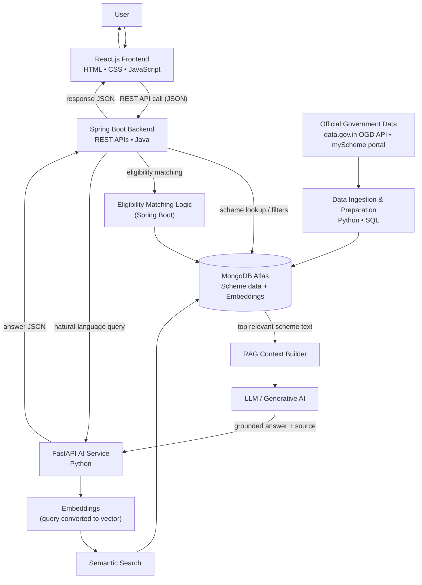

# YojnaSetu: Government Scheme Finder and Eligibility Assistant

*An AI-assisted web platform that helps citizens discover Indian government schemes, understand eligibility rules in simple language, and read verified scheme details in one place.*

---

## Problem Statements and How It Actually Solves the Problem

Government schemes exist for almost every group of citizens. Still, many people never use them. The reason is not the scheme itself. The reason is that finding and understanding the scheme is hard. Below are the real problems and how YojnaSetu handles each one.

### Problem 1: People cannot find schemes that are relevant to them

Most people do not know which schemes exist for their situation. A farmer, a student, and a small shop owner all need different schemes. They usually find out only through word of mouth.

**How YojnaSetu solves it:**
The user enters simple details such as age, state, occupation, income range, gender, and category. The backend matches these details against the eligibility fields stored for each scheme in MongoDB Atlas. The system then shows a shortlist of schemes that match the given inputs, instead of a full list of thousands of schemes.

### Problem 2: Scheme information is scattered across many websites

Central ministries, state departments, and individual scheme portals all publish information separately. A user has to open many sites and read many pages.

**How YojnaSetu solves it:**
YojnaSetu collects verified scheme information from official government sources into one database. All scheme records are stored in MongoDB Atlas in a common structure. The user searches one place. Every scheme record also stores its official source link, so the user can always open the original government page.

### Problem 3: Eligibility rules are hard to understand

Eligibility text is often written in long, formal sentences. It uses terms like "beneficiary", "annual family income", "BPL category", and "domicile". Many users cannot decode this.

**How YojnaSetu solves it:**
The AI service sends the retrieved eligibility text to the LLM with a clear instruction: rewrite this in short, simple sentences. The user reads a plain-language version of the rule. The original official text is also shown next to it, so nothing is hidden or replaced.

### Problem 4: People cannot check whether they qualify

Even after reading the rules, users are unsure if they qualify. They give up rather than risk a rejected application.

**How YojnaSetu solves it:**
YojnaSetu provides an eligibility assistance flow. It asks a short set of questions. It then compares the user's answers with the stored eligibility conditions of each scheme and shows the result as **Likely match**, **Not a match**, or **More information needed**. For each result, it lists which conditions matched and which did not.

**Important limit:** YojnaSetu only gives guidance. It does not approve applications and it does not confirm final eligibility. Only the concerned government department can do that. YojnaSetu states this clearly with every eligibility result.

### Problem 5: Important details like documents and benefits are buried

Users often need one specific detail, such as the list of documents or the last date. They must read a full PDF or a long page to find it.

**How YojnaSetu solves it:**
Each scheme record is stored as separate fields: name, description, benefits, eligibility criteria, required documents, application information, and conditions. The frontend shows these as clean, separate blocks. The user can jump straight to the part they need.

### Problem 6: Government language is complicated

Scheme documents use administrative and legal wording. This blocks people who are not used to such language.

**How YojnaSetu solves it:**
The "Explain simply" feature sends the selected scheme text to the LLM through the FastAPI service. The LLM returns a short, simple explanation built only from that retrieved text. It does not add outside information.

### Problem 7: Comparing schemes is difficult

Two schemes may look similar. The user cannot easily see the difference in benefits or conditions.

**How YojnaSetu solves it:**
The user can select a few relevant schemes and view them side by side. The comparison table uses the same stored fields for every scheme, so benefits, eligibility, and documents line up row by row.

### Problem 8: Normal search needs exact keywords

Search boxes on most portals need official scheme names or exact words. A user who types "help for my daughter's school fees" gets nothing.

**How YojnaSetu solves it:**
YojnaSetu uses semantic search. The user's sentence is converted into an embedding. The system compares this embedding with the stored embeddings of scheme text and returns schemes with similar meaning, not just matching words. Everyday language works.

### Problem 9: Large amounts of scheme text make answers hard to get

Even when a user finds the right page, getting one direct answer from long text takes time.

**How YojnaSetu solves it:**
YojnaSetu uses Retrieval-Augmented Generation. When a user asks a question, the system first retrieves only the most relevant pieces of scheme text. It then sends those pieces to the LLM as context. The LLM answers using that context only. The answer is short, and the source scheme is shown with it.

### Problem 10: There is no single, simple starting point

A user who knows nothing about schemes has no clear place to begin.

**How YojnaSetu solves it:**
YojnaSetu gives one simple interface with three entry points: browse by category, answer a few eligibility questions, or just ask a question in normal language. All three lead to the same verified scheme data.

---

## How It Is Unique From Others

YojnaSetu is not unique because of any single feature. It is unique because of how it combines a few known things into one simple flow.

**Compared with normal scheme listing websites:**
Listing websites mostly show static pages grouped by department or category. The user still has to read and decide. YojnaSetu keeps the same verified data but adds a meaning-based search layer and an eligibility assistance layer on top of it. The user gets a shortlist and a plain-language explanation, not just a page to read.

**Compared with basic keyword search systems:**
Keyword search fails when the user does not know the correct term. YojnaSetu stores embeddings of scheme text and performs semantic search, so a sentence like "money for starting a small business" can still bring up relevant schemes. Keyword search is still available and works together with semantic search.

**Compared with simple FAQ or rule-based chatbots:**
A basic chatbot answers only from a fixed list of questions. If the question is new, it fails. YojnaSetu uses RAG: it retrieves real scheme text from MongoDB Atlas first and then asks the LLM to answer using that retrieved text. This means answers are tied to stored government-sourced content instead of fixed replies.

**Compared with using a general AI chatbot directly:**
A general chatbot can produce scheme details that are outdated or made up. YojnaSetu reduces this risk in two ways. First, the LLM is only allowed to answer from the retrieved scheme text. Second, every answer shows which scheme it came from and links to the official government source.

**The combination that makes it different:**

- Scheme data taken only from official government sources.
- One central place for discovery instead of many portals.
- Search that works with everyday language, not only exact keywords.
- Embeddings and semantic search over scheme text.
- RAG so that generative answers stay grounded in retrieved content.
- LLM used for explanation and summarisation, not for inventing facts.
- Eligibility assistance that shows the matched and unmatched conditions.
- Official source links shown with every scheme and every answer.

**A clear boundary:** YojnaSetu is an information and guidance tool. It does not process applications, does not decide eligibility, and does not replace any government department or officer.

---

## End-to-End System Diagram and Short Explanation

### Short Explanation of the Flow

**Step 1 — Government data is collected first (background process).**
Before a user searches anything, scheme data is collected from official government sources. A Python ingestion script pulls datasets from the Open Government Data (OGD) Platform India API and uses verified scheme details published on the official myScheme portal. SQL is used at this stage to clean and check tabular government datasets before loading.

**Step 2 — Data is stored in MongoDB Atlas.**
Each scheme is stored as one document with fixed fields: name, description, eligibility, benefits, documents, application information, and official source link. The scheme text is also converted into embeddings and stored, so semantic search can be done later. MongoDB Atlas is used because scheme records have different shapes and a document database handles that well.

**Step 3 — The user opens the React.js frontend.**
The frontend is built with HTML, CSS, JavaScript, and React.js. The user can browse categories, fill the eligibility form, or type a question. The frontend does not talk to the database directly. It only calls REST APIs.

**Step 4 — Spring Boot receives the request.**
The Spring Boot backend is the main application layer. It validates the input, handles errors, and decides what to do next. For simple work, such as showing a scheme or filtering by category and state, it reads directly from MongoDB Atlas and replies. For eligibility checking, it compares the user's answers with the stored eligibility conditions.

**Step 5 — AI requests go to the FastAPI service.**
If the request needs AI, such as a natural-language question, Spring Boot forwards it to the FastAPI AI service over REST. The AI work is kept in a separate Python service because the Python ecosystem suits embeddings and LLM work. Keeping it separate also means one service can fail or restart without breaking the whole application.

**Step 6 — The question is converted into an embedding.**
The FastAPI service turns the user's sentence into a vector. This vector represents the meaning of the sentence, not its exact words.

**Step 7 — Semantic search finds the right scheme text.**
The query vector is compared with the scheme embeddings stored in MongoDB Atlas. The most similar pieces of scheme text are returned. This is how "help for my daughter's school fees" can find an education scholarship scheme.

**Step 8 — RAG builds the context.**
The retrieved scheme text is packed into a prompt together with the user's question. This is the Retrieval-Augmented Generation step. It makes sure the model reads real scheme content before answering.

**Step 9 — The LLM writes the answer.**
The LLM produces a short answer in simple language using only the given context. It is instructed not to answer if the context does not contain the information.

**Step 10 — The answer travels back to the user.**
The FastAPI service returns the answer and its source scheme to Spring Boot as JSON. Spring Boot returns it to the React frontend. The frontend displays the answer, the matching schemes, and the official government source link, so the user can verify everything.

---

## Technical Stack

### Languages

| Language | Where it is used |
| --- | --- |
| **Java** | Main application backend built with Spring Boot: REST APIs, request validation, eligibility matching logic, and error handling. |
| **Python** | FastAPI AI service, embedding generation, RAG pipeline, LLM calls, and the government data ingestion scripts. |
| **SQL** | Used during data preparation to query, clean, and verify tabular government datasets (such as CSV data downloaded from official sources) before the cleaned records are loaded into MongoDB Atlas. |

### Frontend

| Technology | Role |
| --- | --- |
| **HTML** | Page structure for scheme cards, forms, and detail pages. |
| **CSS** | Styling, spacing, colours, and responsive layout for mobile and desktop. |
| **JavaScript** | Client-side logic, form handling, and API calls. |
| **React.js** | Component-based user interface: search box, category browser, eligibility form, scheme detail view, comparison view, and Q&A view. Manages application state and renders API responses. |

### Backend and APIs

| Technology | Role |
| --- | --- |
| **Spring Boot** | The main backend service in Java. Serves REST APIs to the frontend, reads and writes scheme data in MongoDB Atlas, runs eligibility matching, and forwards AI requests to the FastAPI service. |
| **FastAPI** | A separate Python service for all AI work: embeddings, semantic search, RAG, and LLM calls. It exposes its own REST endpoints that only the Spring Boot backend calls. |
| **REST APIs** | The communication style used everywhere: frontend to Spring Boot, and Spring Boot to FastAPI. All data is exchanged as JSON. |

### AI

| Component | Role |
| --- | --- |
| **Embeddings** | Scheme text and user queries are converted into vectors. Scheme embeddings are generated once during ingestion and stored. Query embeddings are generated at request time. |
| **Semantic Search** | Compares the query vector with stored scheme vectors to find schemes with similar meaning, even when the words are different. |
| **Retrieval-Augmented Generation (RAG)** | Retrieves relevant scheme text first, then passes it to the LLM as context. This keeps answers based on stored government-sourced content. |
| **LLM Integration** | The FastAPI service calls a language model to summarise, explain, and answer questions using the retrieved context. |
| **Generative AI** | Used to produce simple-language explanations of eligibility rules, benefits, and conditions, and to write short answers to user questions. |

### Database

| Technology | Role |
| --- | --- |
| **MongoDB Atlas** | Cloud-hosted document database. Stores scheme documents, structured eligibility fields, scheme text chunks, and their embeddings. A document model fits scheme data well because different schemes have different fields. Atlas is used so the database is managed and reachable from both deployed services. |

### DevOps and Deployment

| Technology | Role |
| --- | --- |
| **Git** | Version control for all source code. |
| **GitHub** | Central code repository, branches, issues, and pull requests. |
| **GitHub Actions (CI/CD)** | Runs builds and tests automatically on each push, builds Docker images, and triggers deployment. |
| **Docker** | Containerises the Spring Boot backend and the FastAPI AI service so both run the same way locally and in production. |
| **Maven** | Build and dependency management tool for the Java/Spring Boot backend. |
| **Vercel** | Hosting for the React.js frontend. |
| **Render** | Hosting for the containerised Spring Boot backend and FastAPI AI service. |

### Government Data

**Primary API — Open Government Data (OGD) Platform India (data.gov.in)**

- **What it is:** The official open data platform of the Government of India. It is a single point of access to datasets published by ministries, departments, and organisations of the Government of India.
- **Access:** Registered users get a free API key from their account page on data.gov.in. Datasets that support APIs can then be called over REST and returned in JSON or XML.
- **What YojnaSetu uses it for:** Pulling official, machine-readable government datasets that support scheme discovery, such as ministry-published data on welfare programmes, beneficiary categories, and related public data.
- **Accurate role and limit:** The OGD platform gives machine-readable datasets, but it does not publish one single ready-made dataset that contains every scheme with complete eligibility rules, benefits, and document lists in one structured format. So YojnaSetu uses the OGD API for the data it does provide, and fills the remaining scheme details from the official myScheme portal.

**Primary reference source — myScheme (myscheme.gov.in)**

- **What it is:** The Government of India's national platform for search and discovery of Central and State/UT government schemes. It is developed, managed, and operated by the National e-Governance Division (NeGD) under the Ministry of Electronics and Information Technology (MeitY), with Digital India Corporation.
- **What it provides:** For each scheme, myScheme publishes the scheme description, eligibility criteria, benefits offered, application procedure, required documents, and an FAQ section. Schemes are grouped into categories such as Agriculture, Rural & Environment; Education & Learning; Health & Wellness; Housing & Shelter; Skills & Employment; Social Welfare & Empowerment; and Women & Child.
- **What YojnaSetu uses it for:** myScheme is the reference source for the detailed scheme content that YojnaSetu stores and explains.
- **Accurate role and limit:** myScheme does not publish a documented public developer API for third-party applications. So YojnaSetu treats it as an official reference source: verified scheme details are stored in MongoDB Atlas along with the official myScheme link or ministry link for every scheme, and every scheme page in YojnaSetu shows that official source so the user can confirm the details directly on the government site.

**Rule followed for government data:** Only official Government of India sources are used. No unofficial API, no invented endpoint, and no assumed dataset is used. Where an official source does not provide something, YojnaSetu does not fill the gap with generated content — it shows the official link instead.

---

## All Features

### Scheme Discovery

**1. Government Scheme Search**
A search box where the user types anything about their need.
*How it works:* The query is sent to Spring Boot, which runs a keyword match on scheme names and descriptions in MongoDB Atlas and also calls the FastAPI service for semantic matches. Both result sets are merged and shown.

**2. Category-Based Scheme Browsing**
The user can browse schemes grouped under categories such as education, health, agriculture, housing, employment, and women and child.
*How it works:* Each scheme document stores a category field taken from the official source. The frontend requests schemes by category, and Spring Boot returns the filtered list from MongoDB Atlas.

**3. Search by User Needs**
The user selects their situation, such as student, farmer, senior citizen, or small business owner.
*How it works:* Each choice maps to stored tags and eligibility fields on scheme documents. The backend filters schemes using those fields.

**4. Search by Natural-Language Query**
The user can type a full sentence like "loan for starting a tailoring shop in a village".
*How it works:* The sentence goes to the FastAPI service, which converts it into an embedding and runs semantic search over stored scheme embeddings. Schemes with the closest meaning are returned.

**5. Relevant Scheme Recommendations**
After the user gives basic details, the system shows a shortlist of schemes that fit those details.
*How it works:* Spring Boot filters schemes whose stored eligibility fields do not conflict with the user's inputs, then orders them by how many conditions match.

---

### Eligibility Assistance

**6. Eligibility Check Based on User Information**
The user enters details such as age, state, gender, category, occupation, and income range, and gets a guidance result for each shortlisted scheme.
*How it works:* Spring Boot compares each stored eligibility condition with the matching user field and produces a result of Likely match, Not a match, or More information needed.

**7. Eligibility Question Flow**
A short, step-by-step set of questions instead of one long form.
*How it works:* The React frontend shows one question at a time and keeps the answers in state. The full set of answers is sent to the backend in one API call at the end.

**8. Basic Eligibility Matching**
Simple, transparent rule matching on stored fields.
*How it works:* Conditions are stored in a comparable form, for example age range, allowed states, income limit, and allowed categories. Matching is a direct field-by-field comparison. No hidden scoring model is used.

**9. Display of Eligibility Conditions**
The full official eligibility text of a scheme is always shown.
*How it works:* The eligibility field from the scheme document is displayed as-is, next to the simplified version.

**10. Explanation of Why a Scheme May Match**
The result tells the user which conditions matched and which did not.
*How it works:* The matching step returns a list of condition results, and the LLM turns that list into one or two simple sentences.

**11. Display of Missing or Required Information**
If a scheme needs a detail the user did not give, the system says so instead of guessing.
*How it works:* When a condition has no matching user input, it is marked as "information not provided" and listed on screen.

**12. Guidance Notice**
Every eligibility result carries a clear note that this is guidance only and that final eligibility is decided by the concerned government department.
*How it works:* The notice is rendered by the frontend with every result. It is not generated by the model, so it cannot be changed or skipped.

---

### Scheme Information

**13. Complete Scheme Detail Page**
One page per scheme showing all stored fields in clean blocks.
*How it works:* The frontend requests a scheme by its ID, and Spring Boot returns the full document from MongoDB Atlas.

**14. Scheme Name and Description**
The official name and a short summary of what the scheme does.

**15. Eligibility Criteria**
Who can apply, shown in the official wording.

**16. Benefits**
What the applicant receives, such as financial support, subsidy, scholarship, or training.

**17. Required Documents**
The list of documents needed for the application.

**18. Application Information**
How and where to apply, as published by the official source.

**19. Important Conditions**
Any special rules or limits published with the scheme.

**20. Official Source Reference**
Every scheme shows the official government link it came from.
*How it works:* The source URL is stored as a required field on every scheme document. A scheme with no verified source link is not published in the app.

---

### AI Features

**21. LLM Integration**
A language model is used for explaining and answering.
*How it works:* The FastAPI service holds all model calls. Prompts always include retrieved scheme text and an instruction to answer only from that text.

**22. RAG-Based Question Answering**
The user asks a question and gets a short answer built from real scheme content.
*How it works:* Retrieve relevant scheme chunks → build a prompt with those chunks → send to the LLM → return the answer with its source scheme.

**23. Embeddings**
Scheme text and user queries are stored and compared as vectors.
*How it works:* Scheme text is split into chunks during ingestion, each chunk is converted into an embedding, and the embeddings are stored in MongoDB Atlas next to the scheme reference.

**24. Semantic Search**
Meaning-based search instead of exact-word search.
*How it works:* The query embedding is compared with stored chunk embeddings, and the closest chunks are returned.

**25. Generative AI Responses**
Answers are written in natural, readable sentences rather than raw extracts.
*How it works:* The LLM rewrites the retrieved content into a short reply, keeping the facts unchanged.

**26. Context-Based Answers Only**
The assistant does not answer from general knowledge.
*How it works:* If semantic search returns nothing relevant, the service replies that the information is not available in the scheme data and suggests the official source instead.

**27. Simple Explanation of Difficult Text**
An "Explain simply" button on any scheme section.
*How it works:* The selected text is sent to the FastAPI service, and the LLM returns a short, plain-language version. The original text stays visible.

---

### Search and Retrieval

**28. Keyword Search**
Direct text search on scheme names and descriptions.
*How it works:* Spring Boot runs a text query on indexed fields in MongoDB Atlas.

**29. Combined Keyword and Semantic Search**
Both search types run together so exact names and vague descriptions both work.
*How it works:* Results from both methods are merged, duplicates are removed, and the list is ordered by relevance.

**30. Relevant Document Retrieval**
Only the most relevant chunks of scheme text are pulled for an AI answer.
*How it works:* The top matching chunks from semantic search are selected before building the prompt.

**31. Filtering of Scheme Information**
Filters for state, category, gender, age group, and beneficiary type.
*How it works:* Filters are applied as query conditions on scheme fields in MongoDB Atlas.

**32. Retrieval of Related Scheme Details**
Related schemes are suggested on a scheme detail page.
*How it works:* The scheme's own embedding is compared with other scheme embeddings, and the closest ones are shown as related.

**33. Scheme Comparison**
The user selects a few schemes and views them side by side.
*How it works:* The frontend requests the selected scheme documents and renders their common fields as rows in a table.

---

### User Experience

**34. Simple Interface**
A clean layout with a search box, category tiles, and a question box on the home screen.

**35. Easy Scheme Discovery**
Three ways to start: browse, answer questions, or ask in your own words. All three use the same verified data.

**36. Clear Scheme Details**
Every scheme uses the same layout, so users know where to look for documents or benefits.

**37. Easy-to-Understand Answers**
Short sentences, no heavy government wording, and the official text always available beside the simplified version.

**38. User-Friendly Eligibility Assistance**
Plain questions, visible reasons for each result, and a clear note about what the system can and cannot decide.

**39. Responsive Design**
The interface works on mobile and desktop.
*How it works:* CSS responsive layout with React components that resize for smaller screens.

---

### Data and Reliability

**40. Government-Source Data Integration**
Scheme data is taken only from official Government of India sources.
*How it works:* A Python ingestion script calls the data.gov.in OGD API with a free API key and uses verified scheme details published on the official myScheme portal.

**41. Structured Storage in MongoDB Atlas**
All schemes are stored in one common document structure.
*How it works:* Each scheme document has fixed fields plus its embeddings, so search, filtering, and matching all work the same way for every scheme.

**42. Data Updating**
Scheme records are refreshed when new verified data is available.
*How it works:* The ingestion job can be re-run to fetch current data, update changed fields, and regenerate embeddings for text that changed.

**43. Source Display on Every Record**
The official link is shown on every scheme page and with every AI answer.

**44. No Fabricated Scheme Details**
The system never generates scheme facts that are not in the stored data.
*How it works:* The LLM prompt forbids adding information beyond the retrieved context, and any field missing from the source is shown as "Not available from the official source" rather than filled in.

---

### Backend and System Features

**45. REST APIs**
All communication uses REST with JSON.
*How it works:* The frontend calls Spring Boot endpoints, and Spring Boot calls FastAPI endpoints.

**46. Separation of Application Backend and AI Service**
Business logic and AI logic run as two independent services.
*How it works:* Spring Boot handles data, rules, and requests. FastAPI handles embeddings, retrieval, and the LLM. Each can be deployed and scaled on its own.

**47. Secure Handling of API Requests**
Keys and secrets are never exposed to the browser.
*How it works:* The government API key and the LLM key are stored as environment variables on the server. The FastAPI service is called only by the Spring Boot backend, not directly by the frontend. Input is sanitised before use.

**48. Error Handling**
Clear messages instead of blank screens.
*How it works:* Spring Boot returns proper HTTP status codes with readable messages. If the AI service is slow or unavailable, the app still shows keyword search results and stored scheme details.

**49. Basic Validation**
User input is checked before processing.
*How it works:* Age, income, and state values are validated on both the React frontend and the Spring Boot backend, and invalid requests are rejected with a helpful message.

**50. Containerized Deployment Using Docker**
Both backend services run in containers.
*How it works:* Each service has a Dockerfile, so the same image runs locally and in production.

**51. CI/CD Using GitHub Actions**
Builds and deployments run automatically.
*How it works:* On a push to the main branch, the workflow builds the Java project with Maven, runs tests, builds Docker images, and triggers deployment.

**52. Frontend Deployment Using Vercel**
The React.js app is hosted on Vercel and rebuilt automatically on each push to the main branch.

**53. Backend Deployment Using Render**
The Spring Boot backend and the FastAPI AI service run as containerized services on Render, connected to MongoDB Atlas.
